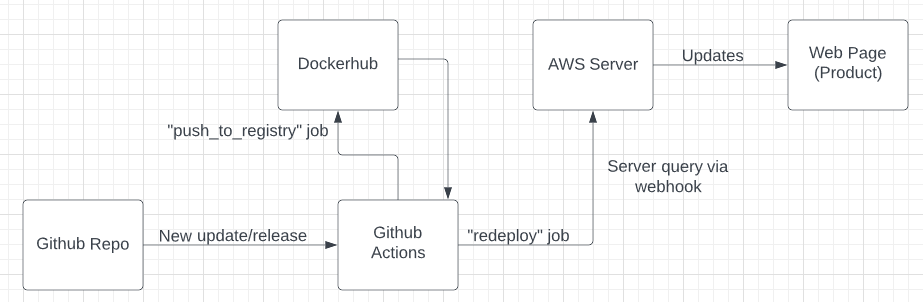

# Project Overview:
This final project for CEG 3120 is to build containers that act as version control for a whole machine rather than just one project. Say a whole team is hired at a company to work on a website and will all need new computers to start working. Rather than wasting the new hires' time downloading and installing everything, they can have their computer's image set to a docker image to quickly become productive.

# Run Project Locally
## Installing Docker
I run Ubuntu (jammy) on my PC, so installed Docker according to [these steps](https://docs.docker.com/engine/install/ubuntu/). That included installing these packages found on Docker's website in this order:
- containerd.io_latest_amd64.deb
- docker-ce-cli_latest_amd64.deb
- docker-compose-plugin_latest_amd64.deb
- docker-ce_latest_amd64.deb

After downloading and installing those packages, run this command to test if Docker installed successfully:
`docker run hello-world`

## Build the Container
To build the docker container (using Apache2), we'll download the official httpd docker image with this command:

`docker pull httpd`
> NOTE: If you're not logged in as the super user, add 'sudo' to the beginning of each of these commands.

Then we can run this command to create the new container:

`docker run -d --name [CONTAINER NAME] -p 80:80 -d httpd`
> NOTE: I'll use the name 'project_5_cont'

The container will have whatever name is put after the '--name' parameter and will tie port 80 of the host machine to port 80 of the docker container.
If you're successful, you should see this page when connecting to the page through your web browser (via [PRIVATE IP]:80):

# DockerHub
## Dockerhub Repo
Creating a DockerHub repo is easy enough. First create a DockerHub account, then select the "repositories" option in DockerHub. From here, select the blue "Create repository" button at the top of the page, then enter a name for the repo. After doing so, you can create the repo.
## Authenticate via CLI
Authenticating and logging into dockerhub from the command line can (surprisingly) be done with one easy command:

`docker login -u [USERNAME] -p [PASSWORD]`
## Push to Dockerhub
To push to DockerHub, first you'll need to log in using the command above. After loggin in, you'll first need to build your container image:

`docker build -t [USERNAME]/[YOUR REPO] .`
> NOTE: Make sure you're running this command in the same directory as your Dockerfile.

After doing that, you can push to DockerHub:

`docker push [USERNAME]/[REPO NAME]`

# Github Actions
## Github Secrets
Github Secrets are encrypted environment variables that can be set per organization or per repository. They can be used in Github actions to help in automation. For example we'll be using secrets to store our login information to DockerHub so that actions can automate docker pushes.

To configure secrets, go to the settings of your repository and select "Secrets" under the "Security" option.
In the Secrets menu, click "New repository secret", and enter a name for the secret and the secret content itself. (In this case, I created two secrets for my docker username and password)
## Behavior of Github workflow
Github Workflows (actions) are automated tasks that Github can run whenever a condition is met. In this project, Github Actions are used to automatically push a docker image to DockerHub. 

The YAML file used can be found in [this tutorial](https://docs.github.com/en/actions/publishing-packages/publishing-docker-images#publishing-images-to-docker-hub). The secrets created earlier are used in lines 27 and 28 of the file to log into Docker on your behalf. This specific file pushes the image to Dockerhub whenever a release is published.

# Deployment
## Container Restart Script
The Container Restart Script (redeploy.sh) is a simple bash script that pulls, stops, then restarts this project's docker container. Lines 2,3, and 5 need to be changed to use your repository and docker container.
## Server Webhook
This part takes place on an AWS Ubuntu Instance (our server). First, we set up a listener on the server using Go, effectively turning the webhook into a service to be tapped in to. After installing webhook onto the server, we can edit the 'webhook.service' file in '/etc/systemd/system/webhook.service'. This is the use of the Webhook Task Definition File (hooks.json).

The hooks.json (webhook definition file) creates the webhook, and sets a script to be run in a certain directory whemever triggered by the endpoint service.

After setting up the webhook service file, we can enable and start the webhook service with these two commands:
`systemctl enable webhook.service`
`systemctl start webhook.service`

After the webhook definition file and service are set up, this command can be run to activate the endpoint:
`webhook -hooks [HOOK FILE].json -verbose`
## Notifier(s) in Github
To set up a webhook notifier in Github, you'll first need webhook installed and configured. Once done, we'll need a new action in our Github actions YAML file (.github/workflows/[ACTIONS FILE].yml). From here we'll want to set up a new job to attach to the endpoint (see redeploy job in docker-image.yml).

This action requires a new secret, named 'DEPLOY_WEBHOOK_URL', which is the address of the webhook endpoint that triggers the redeploy script.